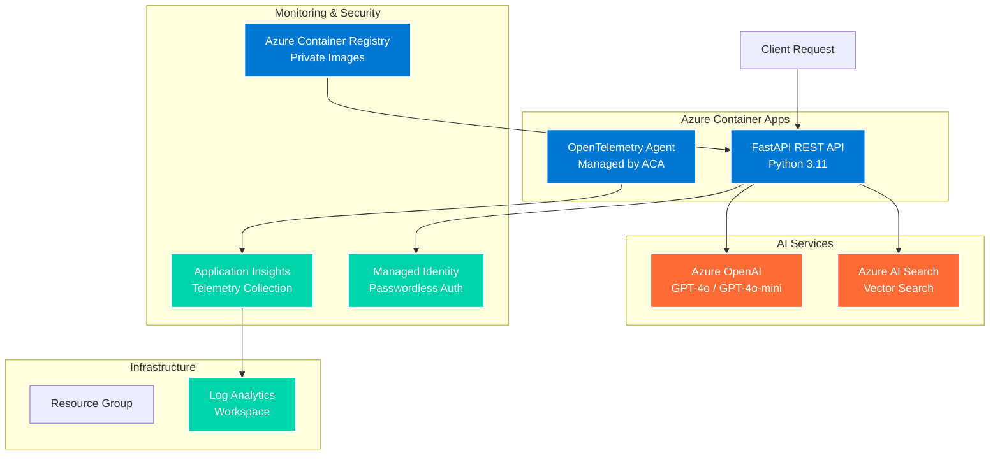

# AI-Enhanced REST API with OpenTelemetry and Azure Container Apps

> **Modern, scalable AI-powered REST API with comprehensive observability, deployed using Azure Developer CLI**

[](https://azure.microsoft.com/services/container-apps/)
[](https://fastapi.tiangolo.com/)
[](https://opentelemetry.io/)
[](https://learn.microsoft.com/azure/developer/azure-developer-cli/)

## 🚀 Quick Start

### Prerequisites
- [Azure Developer CLI (azd)](https://learn.microsoft.com/azure/developer/azure-developer-cli/install-azd)
- [Docker](https://docker.com)
- Azure subscription with access to AI services

### Deploy to Azure
```bash
# Clone and navigate to project
git clone <repository-url>
cd aca-restapi-mcp-otel-openai

# Initialize Azure Developer CLI environment
azd auth login
azd env new dev
azd env set AZURE_LOCATION swedencentral

# Deploy infrastructure and application
azd up
```

## 📋 Architecture Overview



## 🏗️ Project Structure

```
📁 aca-restapi-mcp-otel-openai/
├── 📄 azure.yaml                   # Azure Developer CLI configuration
├── 📄 Dockerfile                   # Container configuration
├── 📄 requirements.txt             # Python dependencies
├── 📁 src/aiapi/
│   └── 📄 server.py                # FastAPI application with OpenTelemetry
├── 📁 infra/                       # Terraform infrastructure as code
│   ├── 📄 main.tf                  # Main infrastructure configuration
│   ├── 📄 variables.tf             # Input variables
│   ├── 📄 outputs.tf               # Output values
│   ├── 📄 container-app.tf         # Azure Container Apps configuration
│   ├── 📄 ai-services.tf           # Azure OpenAI and AI Search
│   └── 📄 monitoring.tf            # Application Insights and logging
└── 📁 .azure/                      # Azure Developer CLI environment
    ├── 📄 config.json              # Environment configuration
    └── 📄 .env                     # Environment variables
```

## 🔧 Configuration

### Key Files

| File | Purpose | Link |
|------|---------|------|
| [`azure.yaml`](./azure.yaml) | Azure Developer CLI project configuration | Defines services and deployment |
| [`src/aiapi/server.py`](./src/aiapi/server.py) | Main FastAPI application | REST API with AI integration |
| [`Dockerfile`](./Dockerfile) | Container configuration | Multi-stage Python build |
| [`infra/main.tf`](./infra/main.tf) | Terraform main configuration | Azure infrastructure definition |
| [`infra/variables.tf`](./infra/variables.tf) | Terraform input variables | Configurable deployment parameters |

### Environment Variables

The application supports flexible configuration through environment variables:

| Variable | Description | Source |
|----------|-------------|---------|
| `AZURE_OPENAI_ENDPOINT` | Azure OpenAI service endpoint | Terraform output |
| `AZURE_SEARCH_ENDPOINT` | Azure AI Search service endpoint | Terraform output |
| `APPLICATIONINSIGHTS_CONNECTION_STRING` | Application Insights telemetry | Terraform output |
| `OTEL_SERVICE_NAME` | OpenTelemetry service name | Manual configuration |
| `OTEL_SERVICE_VERSION` | Service version for telemetry | Manual configuration |

## 🤖 AI Integration

### Azure OpenAI
- **Models**: GPT-4o and GPT-4o-mini deployments
- **Authentication**: Azure AD managed identity (no API keys)
- **Integration**: Async client with proper error handling

### Azure AI Search
- **Vector Search**: Semantic search capabilities
- **Index**: Pre-configured for document search
- **Integration**: Native Azure SDK with managed identity

### Sample API Usage
```bash
# Health check
curl https://your-app.azurecontainerapps.io/health

# AI-powered query
curl -X POST https://your-app.azurecontainerapps.io/query \
  -H "Content-Type: application/json" \
  -d '{
    "query": "What is the main topic of the documents?",
    "max_results": 5,
    "temperature": 0.7
  }'
```

## 📊 Observability

### OpenTelemetry Integration

The application implements **dual-mode telemetry** for maximum flexibility:

#### Mode 1: Azure Monitor (Recommended)
- **Trigger**: `APPLICATIONINSIGHTS_CONNECTION_STRING` environment variable present
- **Features**:
  - Automatic instrumentation (FastAPI, HTTP requests, Azure SDKs)
  - Traces, metrics, and logs sent to Application Insights
  - Built-in correlation and sampling
- **Configuration**: Managed by Azure Container Apps

#### Mode 2: Manual OTLP Export
- **Trigger**: No Application Insights connection string
- **Features**:
  - Custom OTLP exporter configuration
  - Flexible endpoint resolution
  - Manual instrumentation control
- **Endpoint Resolution Priority**:
  1. `OTEL_EXPORTER_OTLP_TRACES_ENDPOINT`
  2. `OTEL_EXPORTER_OTLP_ENDPOINT`
  3. `CONTAINERAPP_OTEL_TRACING_GRPC_ENDPOINT` (ACA managed)
  4. `http://localhost:4317` (development)

### Monitoring Stack
- **Application Insights**: APM, error tracking, performance metrics
- **Log Analytics**: Centralized logging and querying
- **Azure Monitor**: Infrastructure and platform metrics
- **OpenTelemetry**: Distributed tracing across services

## 🚀 Deployment Options

### Azure Developer CLI (Recommended)
```bash
# Full deployment
azd up

# Infrastructure only
azd provision

# Application only
azd deploy

# Environment management
azd env set KEY value
azd env select environment-name
```

### Container Image Promotion Flow
- **Bootstrap**: Terraform deploys the Container App with the public sample image so the first `azd provision` succeeds even before the project image exists (`infra/container-app.tf`).
- **Post-deploy sync**: After the first `azd deploy`, Azure Developer CLI emits `SERVICE_API_IMAGE_NAME`/`SERVICE_API_RESOURCE_EXISTS`; the hook at `scripts/postdeploy-update-container-image.sh` copies the baked image reference into `CONTAINER_IMAGE_REVISION` and `TF_VAR_container_image_revision`.
- **Subsequent runs**: Terraform reads `var.container_image_revision` (see `infra/variables.tf`) and automatically swaps the Container App to your registry image on later `azd up`/`azd provision` executions—no manual edits required.

### Traditional Terraform
```bash
cd infra
terraform init
terraform plan -var-file="main.tfvars.json"
terraform apply
```

## 🔒 Security Features

- **🔐 Passwordless Authentication**: Azure AD managed identity for all Azure services
- **🛡️ Private Networking**: Optional private endpoints for service isolation
- **🚫 No Secrets**: All sensitive values managed through Azure Key Vault references
- **🔏 Container Security**: Non-root user, minimal attack surface
- **📋 RBAC**: Principle of least privilege for all service connections

## 🏃‍♂️ Development

### Local Development
```bash
# Install dependencies
pip install -r requirements.txt

# Set environment variables (see .env.example)
export AZURE_OPENAI_ENDPOINT="your-endpoint"
export AZURE_SEARCH_ENDPOINT="your-search-endpoint"

# Run application
python -m uvicorn src.aiapi.server:app --reload --port 8000
```

### Container Development
```bash
# Build container
docker build -t aca-restapi-mcp-otel-openai .

# Run container
docker run -p 8000:8000 \
  -e AZURE_OPENAI_ENDPOINT="your-endpoint" \
  aca-restapi-mcp-otel-openai
```

## 📈 Scaling & Performance

- **Auto-scaling**: Azure Container Apps scale based on HTTP traffic and CPU/memory
- **Regional Deployment**: Deployed to Sweden Central for optimal performance
- **Container Optimization**: Multi-stage build, Python 3.11 slim base image
- **Connection Pooling**: Async Azure SDK clients with connection reuse
- **Telemetry Sampling**: Configurable trace sampling to manage overhead

## 🤝 Contributing

1. Fork the repository
2. Create a feature branch (`git checkout -b feature/amazing-feature`)
3. Commit your changes (`git commit -m 'Add some amazing feature'`)
4. Push to the branch (`git push origin feature/amazing-feature`)
5. Open a Pull Request

## 📝 License

This project is licensed under the MIT License - see the [LICENSE](LICENSE) file for details.

## 🆘 Support

- **Documentation**: [Azure Container Apps docs](https://docs.microsoft.com/azure/container-apps/)
- **Azure Developer CLI**: [azd documentation](https://learn.microsoft.com/azure/developer/azure-developer-cli/)
- **OpenTelemetry**: [Python instrumentation guide](https://opentelemetry.io/docs/instrumentation/python/)
- **Issues**: Open an issue in this repository

---

**Built with ❤️ using Azure Container Apps, FastAPI, and OpenTelemetry**
