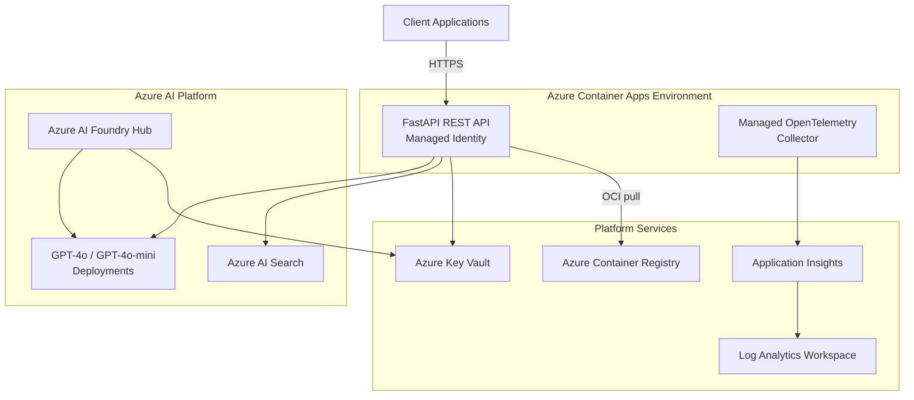

# AI-Enhanced REST API on Azure Container Apps
> A production-ready FastAPI service with Azure AI, managed identity, and end-to-end observability.

- **Deploy once** with Azure Developer CLI; Terraform provisions every Azure resource.
- **Develop locally** with the same settings the cloud build uses.
- **Observe everything** via the Managed OpenTelemetry collector and Application Insights.

---

## At a Glance
- [Deploy to Azure](#deploy-to-azure) — create or update an environment with `azd`.
- [Run locally](#local-development) — hack on the FastAPI app without touching Azure.
- [Understand the architecture](#architecture) — visualize services, identities, and telemetry.
- [Solve the container image chicken-and-egg](#container-image-chicken-and-egg) — why the first deploy needs special handling.
- [Tune Terraform inputs](#configuration-cheat-sheet) — feature flags and frequently changed variables.

---

## Before You Start

### Prerequisites
- Azure subscription with permission to create Azure Container Apps, Azure AI, Storage, Key Vault, and networking resources.
- [Azure CLI](https://learn.microsoft.com/cli/azure/install-azure-cli) plus `az login` configured.
- [Azure Developer CLI (`azd`)](https://learn.microsoft.com/azure/developer/azure-developer-cli/install-azd) 1.6.0 or later.
- [Docker](https://www.docker.com/) for local builds and the `azd deploy` container build step.
- Python 3.11 (optional, only for local development) with `pip`.

### Repository Layout (high level)
```
📦 aca-restapi-mcp-otel-openai
├── azure.yaml                 # azd service definition and deployment hooks
├── infra/                     # Terraform modules (container app, AI, security, networking)
├── scripts/                   # azd hook scripts
├── src/aiapi/server.py        # FastAPI app with Azure AI integration and OTEL wiring
├── Dockerfile                 # Multi-stage build, CPU optimized
└── requirements.txt           # Python dependencies
```

---

## Deploy to Azure
You can run everything from the repository root.

### 1. Authenticate and create/select an environment
```bash
azd auth login
azd env new dev            # or reuse an existing name
azd env set AZURE_LOCATION swedencentral   # choose any Azure region supported by Container Apps
```

### 2. Configure feature flags (optional)
Use `azd env set` to pass Terraform variables or app settings:
```bash
azd env set TF_VAR_enable_private_endpoints false
azd env set TF_VAR_ai_model_set full
azd env set ENABLE_OTEL true                  # turns on FastAPI instrumentation
```
See the [configuration cheat sheet](#configuration-cheat-sheet) for more.

### 3. Provision infrastructure and deploy the app
```bash
azd up
```
`azd up` builds the container image, publishes it to ACR, applies Terraform, and rolls the Container App forward using the post-deploy hook described below.

### 4. Useful follow-up commands
```bash
azd deploy             # re-deploy code without touching infrastructure
azd provision          # re-run Terraform without rebuilding code
azd env get-values     # inspect the current environment settings
azd monitor --overview # jump to Azure Monitor pre-filtered views
```

### 5. Clean up
```bash
azd down               # prompts to delete Azure resources in the environment
```

---

## Local Development
You can iterate locally without touching Azure. The app respects the same environment variables that Terraform injects in the cloud.

```bash
python -m venv .venv
source .venv/bin/activate
pip install -r requirements.txt

# Provide the endpoints you want to call; use either real Azure services or local mocks
export ENABLE_OTEL=true
export AZURE_OPENAI_ENDPOINT="https://<your-openai-endpoint>.openai.azure.com"
export AZURE_SEARCH_ENDPOINT="https://<your-search>.search.windows.net"
export AZURE_SEARCH_INDEX="documents"

python -m uvicorn src.aiapi.server:app --reload --port 8000
```
Visit `http://localhost:8000/api-explorer` to explore the automatically generated Swagger UI.

### Running in Docker
```bash
docker build -t aca-restapi-mcp-otel-openai .
docker run --rm -p 8000:8000 \
  -e ENABLE_OTEL=true \
  -e AZURE_OPENAI_ENDPOINT="https://<endpoint>" \
  -e AZURE_SEARCH_ENDPOINT="https://<search>.search.windows.net" \
  -e AZURE_SEARCH_INDEX="documents" \
  aca-restapi-mcp-otel-openai
```

---

## Architecture


Key ideas:
- **Managed identity** removes the need for secrets; the Container App authenticates to Azure OpenAI, Search, Key Vault, and ACR through Entra ID.
- **Managed OpenTelemetry** mirrors traces and logs into Application Insights with no agent maintenance.
- **Azure AI Foundry** lights up end-to-end governance and projects; Terraform can be toggled to use a basic OpenAI account instead.

---

## Container Image Chicken-and-Egg
Terraform needs a valid container image reference before it can create a revision, but the first `azd provision` runs *before* your image exists in Azure Container Registry. This repo solves the bootstrap loop like this:

1. **Terraform fallback** — `infra/container-app.tf` points the Container App to a public sample image (`mcr.microsoft.com/azuredocs/containerapps-helloworld:latest`) when `var.container_image_revision` is empty. That lets Terraform finish the initial apply.
2. **Build real image** — `azd deploy` (invoked during `azd up`) builds your app and pushes it to ACR.
3. **Post-deploy hook** — `scripts/postdeploy-update-container-image.sh` copies `SERVICE_API_IMAGE_NAME` into both `CONTAINER_IMAGE_REVISION` and `TF_VAR_container_image_revision` environment values.
4. **Subsequent runs** — Terraform now sees a concrete ACR digest/tag, enabling the Container App to reference your private image while still logging in with the managed identity.

You never have to edit Terraform files—just let the hook manage the revision variables.

---

## Configuration Cheat Sheet
Most configuration flows through `azd env set`. Key settings:

| Purpose | Environment key | Notes |
|---------|-----------------|-------|
| Azure region | `AZURE_LOCATION` | Controls where resources are created. |
| Toggle private endpoints | `TF_VAR_enable_private_endpoints` | Requires Premium SKU registry (already default). Set `true` for private networking. |
| Deploy GPT-4o only vs + mini | `TF_VAR_ai_model_set` | `minimal` or `full` (default). |
| Disable AI Foundry | `TF_VAR_enable_ai_foundry` | Set `false` to keep only a Cognitive Services OpenAI account. |
| Turn on Container Apps auth | `TF_VAR_enable_container_app_auth` | Enabled by default; disables if set to `false`. |
| Force internal-only ingress | `TF_VAR_container_app_public` | Set `false` for private endpoints and no public URL. |
| Enable managed OTEL agent | `TF_VAR_enable_container_apps_managed_otel` | When `true`, enables traces/logs to Application Insights automatically. |
| Force app OTEL instrumentation | `ENABLE_OTEL` | App-side toggle. When `true`, FastAPI + Requests instrumentation is enabled. |

All other Terraform variables are documented inline in `infra/variables.tf`. You can also keep per-environment settings in `.azure/<env>/.env`.

---

## Observability & Telemetry
- **Managed Agent path**: Enable `TF_VAR_enable_container_apps_managed_otel=true`. Container Apps streams traces and logs into Application Insights using the connection string provisioned by Terraform.
- **Manual OTLP path**: Leave the feature disabled; the app will fall back to OTLP gRPC export using `OTEL_EXPORTER_OTLP_*` variables (ACA injects defaults automatically).
- **Instrumentation control**: Set `ENABLE_OTEL=true` to wire FastAPI + outbound request tracing; leave unset for minimal overhead.
- **Dashboards**: Use `azd monitor --overview` to jump directly into the curated Azure Monitor workbook for your Container App.

---

## Troubleshooting Tips
- `azd up` fails before Terraform? Run `azd provision` to surface IaC errors, then `azd deploy` once resolved.
- Container App stuck on the sample image? Ensure the post-deploy hook ran and that `CONTAINER_IMAGE_REVISION` has a value (`azd env get-value CONTAINER_IMAGE_REVISION`).
- Managed identity permission issues? Rerun `azd provision`—Terraform manages all role assignments.
- Need to inspect Terraform state locally? `cd infra && terraform plan -out plan.tfplan` (uses the azd-generated environment variables).

---

## Contributing
1. Create a feature branch: `git checkout -b feature/awesome-thing`.
2. Run `azd up` (or `azd deploy`) against your sandbox environment to validate.
3. Add tests or scripts if you introduce new functionality.
4. Open a pull request describing the change, pipeline impact, and testing.

---

Licensed under the [MIT License](LICENSE).
