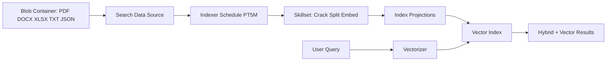
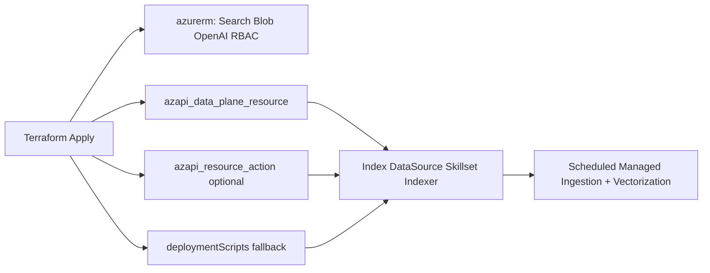
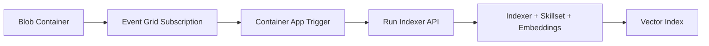
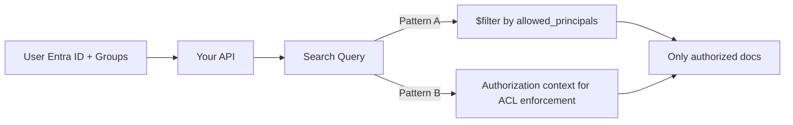

# Azure AI Search Managed Ingestion Options

## Scope
Ingest `PDF`, `DOCX`, `XLSX`, `TXT`, and `JSON` from Azure Blob Storage into Azure AI Search with:
- automatic indexing of new/updated files
- deletion sync when blobs are removed
- embeddings + vector search
- managed-first operations

## Option 1 (Recommended): Scheduled Managed Indexer + Skillset + Integrated Vectorization

Use Azure AI Search native objects only:
- Blob `data source`
- `indexer` on schedule (for example `PT5M`)
- `skillset` for chunking + embedding
- `index projections` for chunk-level RAG docs
- query-time `vectorizer` for text-to-vector

How it stays in sync:
- New/changed blobs are picked up incrementally by indexer state.
- Deleted blobs are removed using blob deletion detection policy (use Blob soft delete guidance from docs).

Best when:
- You want minimal custom code and fully managed operations.

### Option 1 Terraform-Only Implementation (AzAPI-first)

Reality check:
- Azure AI Search **management** is ARM, but index/data source/skillset/indexer are documented as **data plane** tasks.
- You do **not** need repo shell scripts for this. `azapi_data_plane_resource` can manage Azure Search data-plane objects directly.

Implementation shape:
1. Provision core infra with Terraform (`azurerm_search_service`, Blob Storage, Azure OpenAI, identities, RBAC).
2. Define these with `azapi_data_plane_resource`:
   - `Microsoft.Search/searchServices/indexes@...`
   - `Microsoft.Search/searchServices/datasources@...`
   - `Microsoft.Search/searchServices/skillsets@...`
   - `Microsoft.Search/searchServices/indexers@...`
3. Keep payloads in Terraform locals/jsonencode so the whole ingestion pipeline is declarative.
4. Configure indexer schedule (`PT5M`) and deletion detection policy.
5. Use one indexer for mixed docs (`PDF/DOCX/XLSX/TXT`), and optionally a second JSON-focused indexer with `json`/`jsonArray`/`jsonLines` parsing mode.

Alternatives if needed:
1. `azapi_resource_action` for imperative calls (for example run indexer), but weaker lifecycle/drift semantics.
2. `azapi_resource` + `Microsoft.Resources/deploymentScripts` as fallback if a specific API shape is awkward in `azapi_data_plane_resource`.
3. Third-party generic REST Terraform providers (possible, but less preferred than first-party AzAPI).

## Option 2: Event Grid + Container App Trigger + Managed Indexer Pipeline

Keep the same managed indexer/skillset/vector pipeline, but trigger runs on blob events for lower latency.
- Event Grid subscribes to Blob Created/Deleted events.
- A small Container App receives events and calls `Run Indexer` API.
- Keep a fallback schedule on indexer (for resiliency).

Container App responsibilities:
- validate Event Grid event
- optionally debounce/coalesce rapid events
- call Search indexer run endpoint with managed identity

Best when:
- You need near-real-time indexing but still want Search-managed enrichment and vectorization.

## Practical Recommendation
- Start with **Option 1** (simpler, fully managed, usually enough).
- Move to **Option 2** if freshness requirements are tighter than scheduled runs.

## Access Control (Who Can See Which Document)

### Pattern A (GA): Security Filters
- Add an ACL field like `allowed_principals` (user/group IDs) per chunk/document at ingestion.
- At query time, your API adds an OData filter so users only retrieve permitted documents.

### Pattern B (Newer, for permission inheritance): Native ACL/Permission Filter Flow
- Use blob indexer permission ingestion options (for RBAC scope metadata).
- Query with authorization context so Search enforces ACL trimming.
- Treat this as an advanced path; verify current feature status in your tenant before relying on it as sole control.

Recommended in principle:
- Use **Pattern A** as baseline (portable and explicit).
- Add **Pattern B** where supported to reduce ACL duplication and align with source-system permissions.

## References
- [Blob indexer and supported formats](https://learn.microsoft.com/en-us/azure/search/search-how-to-index-azure-blob-storage)
- [Detect changed and deleted blobs](https://learn.microsoft.com/en-us/azure/search/search-howto-index-changed-deleted-blobs)
- [Integrated vectorization](https://learn.microsoft.com/en-us/azure/search/vector-search-integrated-vectorization)
- [Set up integrated vectorization (REST)](https://learn.microsoft.com/en-us/azure/search/search-how-to-integrated-vectorization)
- [Index projections (chunk indexing)](https://learn.microsoft.com/en-us/azure/search/search-how-to-define-index-projections)
- [JSON blob parsing modes](https://learn.microsoft.com/en-us/azure/search/search-howto-index-json-blobs)
- [Indexer scheduling](https://learn.microsoft.com/en-us/azure/search/search-howto-schedule-indexers)
- [azapi_data_plane_resource](https://registry.terraform.io/providers/Azure/azapi/latest/docs/resources/data_plane_resource)
- [azapi_resource_action](https://registry.terraform.io/providers/Azure/azapi/latest/docs/resources/resource_action)
- [Search Service REST API (management vs data plane tasks)](https://learn.microsoft.com/en-us/rest/api/searchmanagement/)
- [Indexes - Create Or Update](https://learn.microsoft.com/en-us/rest/api/searchservice/indexes/create-or-update)
- [Data Sources - Create Or Update](https://learn.microsoft.com/en-us/rest/api/searchservice/data-sources/create-or-update)
- [Skillsets - Create](https://learn.microsoft.com/en-us/rest/api/searchservice/skillsets/create)
- [Indexers - Create Or Update](https://learn.microsoft.com/en-us/rest/api/searchservice/indexers/create-or-update)
- [Run indexer API](https://learn.microsoft.com/en-us/rest/api/searchservice/indexers/run)
- [Event Grid for Blob Storage](https://learn.microsoft.com/en-us/azure/event-grid/event-schema-blob-storage)
- [Security filters for trimming results](https://learn.microsoft.com/en-us/azure/search/search-security-trimming-for-azure-search)
- [Blob indexer role-based access metadata](https://learn.microsoft.com/en-us/azure/search/search-blob-indexer-role-based-access)
- [Query-time ACL enforcement](https://learn.microsoft.com/en-us/azure/search/search-query-access-control-rbac-enforcement)
- [ARM deploymentScripts resource](https://learn.microsoft.com/en-us/azure/azure-resource-manager/templates/deployment-script-template)
