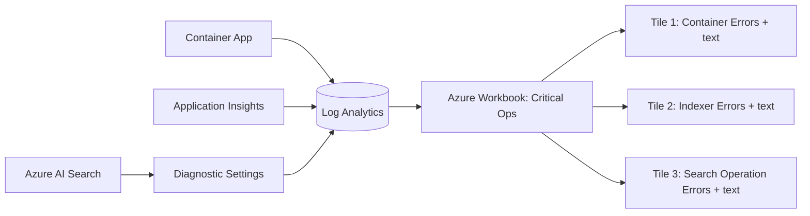

# Critical Ops Workbook Idea (Managed, Basic)

Goal: a minimal Azure Workbook showing the most critical runtime issues with error text, not only counts.

## Scope

1. Container App errors
2. Indexer errors
3. Azure AI Search operation errors

## Managed-First Approach

- Use `azurerm_application_insights_workbook` for the dashboard.
- Keep logs in Log Analytics / App Insights (already managed).
- Add Search diagnostics to Log Analytics via `azurerm_monitor_diagnostic_setting`.

## Terraform Changes (MVP)

1. Add workbook resource:
   - `azurerm_application_insights_workbook`
   - 3 query tiles:
     - Container App error logs (text)
     - Indexer error logs (text)
     - Search operation error logs (text)
2. Add Search diagnostic settings:
   - `azurerm_monitor_diagnostic_setting` on `azurerm_search_service.main`
   - send `OperationLogs` (+ optional metrics) to `azurerm_log_analytics_workspace.main`
3. Add outputs:
   - workbook id/name/portal link

## Diagram

## Known Limitation

Detailed per-document indexer warning text can be richer in the Indexer Status API than in diagnostics.

If needed later: add a small managed collector (for example a Container Apps Job) that polls indexer status and writes normalized rows to Log Analytics for richer per-document flow views.
