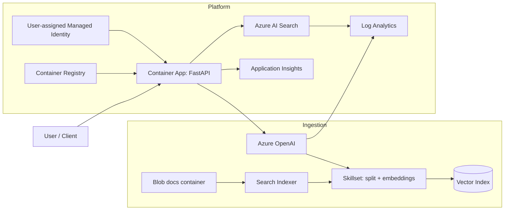
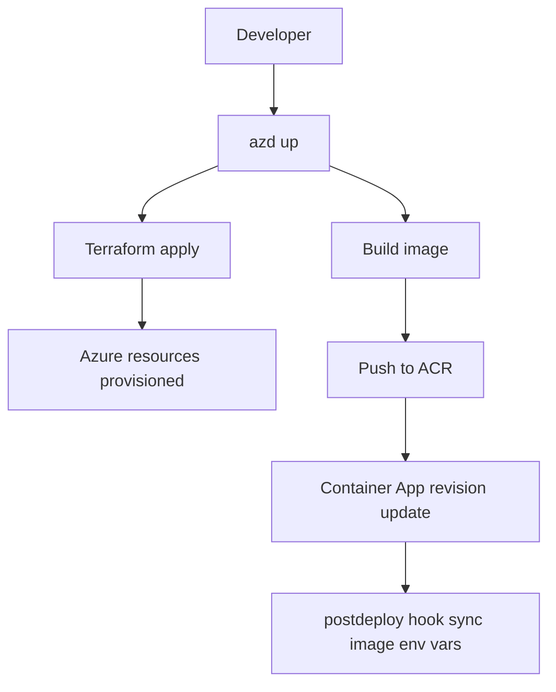
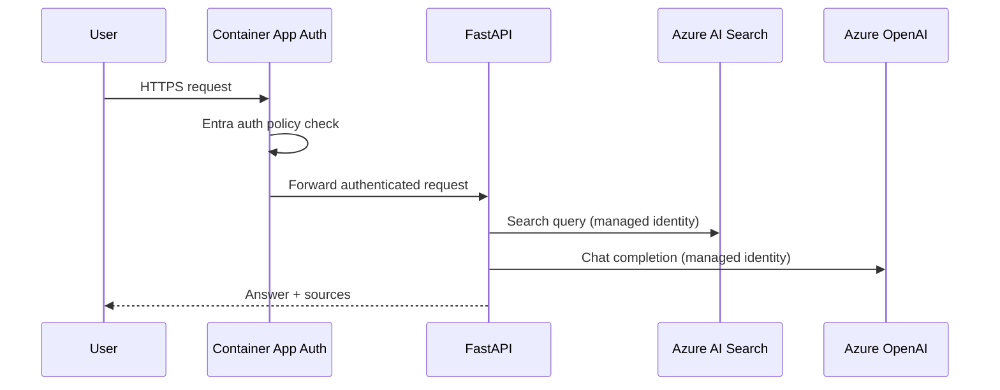
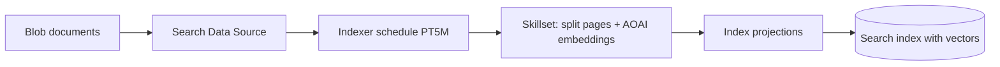
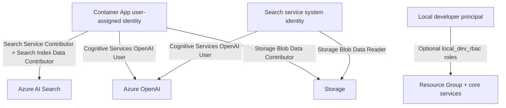
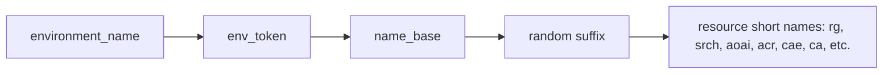
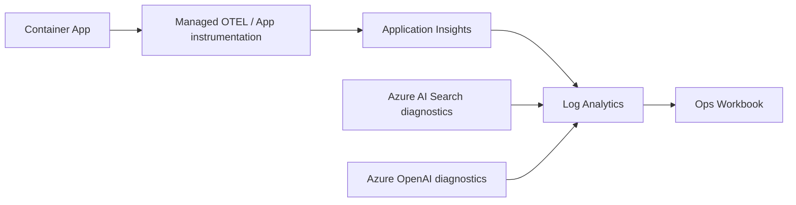
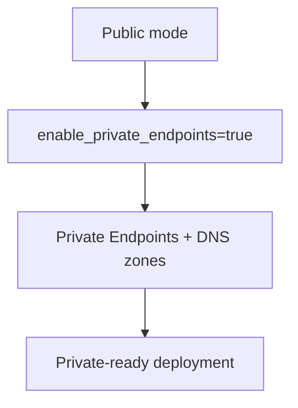

# Project Walkthrough (Presentation Style)

This walkthrough is meant to be read like a short deck. It maps architecture, deployment, ingestion, security, and ops for this repo.

## 0) Agenda
- [Slide 1: What this project is](#1-what-this-project-is)
- [Slide 2: End-to-end architecture](#2-end-to-end-architecture)
- [Slide 3: Provision + deploy flow](#3-provision--deploy-flow)
- [Slide 4: Runtime request/auth flow](#4-runtime-requestauth-flow)
- [Slide 5: Managed AI Search ingestion (Option 1)](#5-managed-ai-search-ingestion-option-1)
- [Slide 6: Identity + RBAC model](#6-identity--rbac-model)
- [Slide 7: Naming strategy and collision resistance](#7-naming-strategy-and-collision-resistance)
- [Slide 8: Observability and ops](#8-observability-and-ops)
- [Slide 9: Private networking readiness](#9-private-networking-readiness)
- [Slide 10: Local dev + verification](#10-local-dev--verification)
- [Slide 11: Change map (where to edit what)](#11-change-map-where-to-edit-what)

---

## 1) What this project is
- FastAPI API on Azure Container Apps with Azure OpenAI + Azure AI Search.
- Terraform-first infrastructure with `azd` orchestration.
- Managed ingestion pipeline for blob documents (PDF/DOCX/XLSX/TXT/JSON) into vector-ready Azure AI Search.

Key entry points:
- [README](../README.md)
- [azd config](../azure.yaml)
- [App server](../src/aiapi/server.py)
- [Terraform root](../infra)

---

## 2) End-to-end architecture



Terraform/service files:
- [Container App](../infra/container-app.tf)
- [AI Services/OpenAI deployments](../infra/ai-services.tf)
- [Search service](../infra/search.tf)
- [Search index/data source/skillset/indexer](../infra/search-index.tf)
- [Monitoring diagnostics](../infra/diagnostics.tf)

---

## 3) Provision + deploy flow



Flow references:
- [azd project definition](../azure.yaml)
- [postdeploy hook script](../scripts/postdeploy-update-container-image.sh)
- [Container image fallback logic](../infra/container-app.tf)

---

## 4) Runtime request/auth flow



Auth and app logic:
- [Container App auth Terraform](../infra/aad-auth.tf)
- [Auth usage guide](./container-apps-authentication-usage.md)
- [FastAPI query endpoint](../src/aiapi/server.py)

---

## 5) Managed AI Search ingestion (Option 1)

This repo’s preferred approach is fully managed ingestion with Terraform + AzAPI data-plane resources.



Implemented in:
- [Search ingestion resources](../infra/search-index.tf)
- [Search and ingestion variables](../infra/variables.tf)
- [Search outputs for local/dev](../infra/outputs.tf)
- [Managed ingestion options](./ai-search-managed-ingestion-options.md)
- [Ingestion methods comparison](./ai-search-document-ingestion-methods.md)

---

## 6) Identity + RBAC model



Role assignment source:
- [RBAC definitions](../infra/rbac.tf)
- [Local dev principal variable](../infra/variables.tf)

---

## 7) Naming strategy and collision resistance

Resource naming is based on:
- `environment_name` tokenization and short hashing
- short prefixes per service
- random suffix for uniqueness



Naming logic:
- [Naming locals](../infra/locals.tf)
- [Core input variables](../infra/variables.tf)

This is designed so you can deploy many environments without name collisions.

---

## 8) Observability and ops



Operational docs and config:
- [Monitoring resources](../infra/monitoring.tf)
- [Diagnostic settings](../infra/diagnostics.tf)
- [Critical ops workbook idea](./ops-critical-workbook-idea.md)

---

## 9) Private networking readiness

Current posture can stay public, but Terraform already supports switching to private endpoints.



Related files:
- [Private endpoint orchestration](../infra/private-endpoints.tf)
- [Private link module](../infra/modules/private_link)
- [Networking variables](../infra/variables.tf)

---

## 10) Local dev + verification

Core local and verification workflow:

```bash
uv venv --python 3.11 .venv
uv pip install --python .venv/bin/python -r requirements.txt
uv run --python .venv/bin/python scripts/e2e_verify_search.py
```

Validation script:
- [E2E search verification](../scripts/e2e_verify_search.py)

Useful outputs/env values:
- `AZURE_SEARCH_ENDPOINT`
- `AZURE_SEARCH_INDEX`
- `AZURE_SEARCH_INDEXER_NAME`
- `AZURE_OPENAI_ENDPOINT`

Source of outputs:
- [Terraform outputs](../infra/outputs.tf)

---

## 11) Change map (where to edit what)

- API behavior/routes: [src/aiapi/server.py](../src/aiapi/server.py)
- Container App auth settings: [infra/aad-auth.tf](../infra/aad-auth.tf)
- Search schema/indexer/skillset: [infra/search-index.tf](../infra/search-index.tf)
- RBAC changes: [infra/rbac.tf](../infra/rbac.tf)
- Naming/env behavior: [infra/locals.tf](../infra/locals.tf), [infra/variables.tf](../infra/variables.tf)
- Observability/diagnostics: [infra/monitoring.tf](../infra/monitoring.tf), [infra/diagnostics.tf](../infra/diagnostics.tf)
- Deployment orchestration: [azure.yaml](../azure.yaml), [scripts/postdeploy-update-container-image.sh](../scripts/postdeploy-update-container-image.sh)

---

## External references
- [Azure Container Apps](https://learn.microsoft.com/en-us/azure/container-apps/overview)
- [Azure AI Search indexer overview](https://learn.microsoft.com/en-us/azure/search/search-indexer-overview)
- [Integrated vectorization](https://learn.microsoft.com/en-us/azure/search/vector-search-integrated-vectorization)
- [Azure OpenAI RBAC](https://learn.microsoft.com/en-us/azure/ai-services/openai/how-to/role-based-access-control)
- [Terraform AzAPI provider](https://registry.terraform.io/providers/Azure/azapi/latest/docs)
- [Azure Monitor Application Insights](https://learn.microsoft.com/en-us/azure/azure-monitor/app/app-insights-overview)
- [Azure Developer CLI](https://learn.microsoft.com/en-us/azure/developer/azure-developer-cli/)
